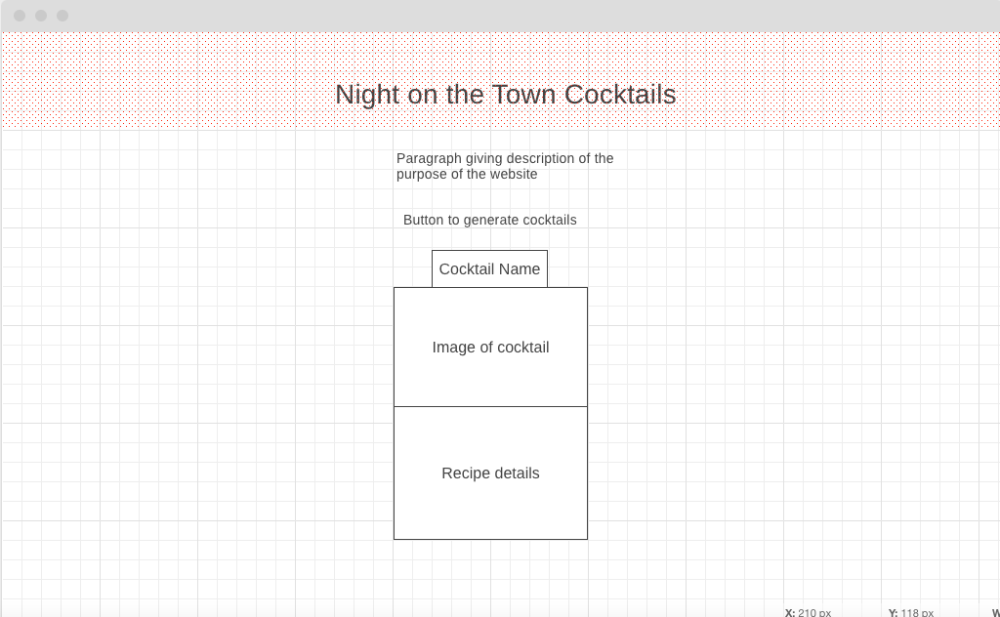
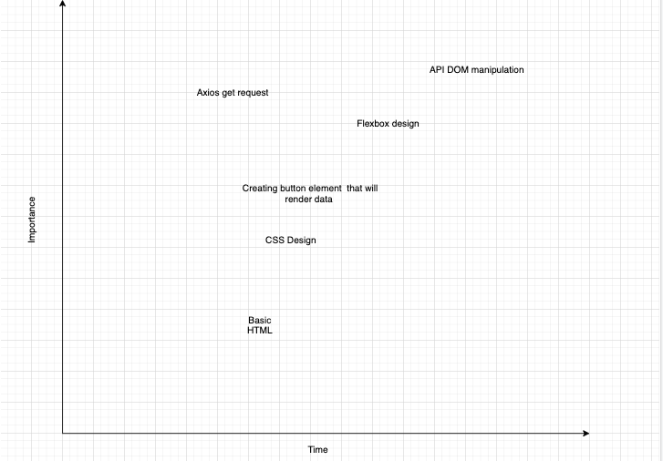

# Project Overview

## Project Name

Night on the Town Cocktails

## Project Description

A website that is useful for people who are ready to go for a night on the town but need a little help deciding what cocktails to make before they go out.

## API and Data Sample

www.thecocktaildb.com/api/json/v1/1/random.php

{
    "drinks": [
        {
            "idDrink": "178355",
            "strDrink": "Mountain Bramble",
            "strDrinkAlternate": null,
            "strTags": null,
            "strVideo": null,
            "strCategory": "Cocktail",
            "strIBA": null,
            "strAlcoholic": "Alcoholic",
            "strGlass": "Old-fashioned glass",
            "strInstructions": "Muddle the blackberries in a tumbler glass. Mix the Gin, lemon juice and sugar syrup in a shaker and strain over chopped ice. Top with Soda water and garnish with more blackberries and some mint",
            "strInstructionsES": null,
            "strInstructionsDE": null,
            "strInstructionsFR": null,
            "strInstructionsIT": null,
            "strInstructionsZH-HANS": null,
            "strInstructionsZH-HANT": null,
            "strDrinkThumb": "https://www.thecocktaildb.com/images/media/drink/stwiva1619704025.jpg",
            "strIngredient1": "Gin",
            "strIngredient2": "Lemon Juice",
            "strIngredient3": "Sugar Syrup",
            "strIngredient4": "Blackberries",
            "strIngredient5": "Soda Water",
            "strIngredient6": "Mint",
            "strIngredient7": "",
            "strIngredient8": null,
            "strIngredient9": null,
            "strIngredient10": null,
            "strIngredient11": null,
            "strIngredient12": null,
            "strIngredient13": null,
            "strIngredient14": null,
            "strIngredient15": null,
            "strMeasure1": "2 oz",
            "strMeasure2": "0.75 oz",
            "strMeasure3": "0.75 oz",
            "strMeasure4": "Ground",
            "strMeasure5": "Top",
            "strMeasure6": "Garnish with",
            "strMeasure7": "",
            "strMeasure8": null,
            "strMeasure9": null,
            "strMeasure10": null,
            "strMeasure11": null,
            "strMeasure12": null,
            "strMeasure13": null,
            "strMeasure14": null,
            "strMeasure15": null,
            "strImageSource": "https://www.instagram.com/p/COOkFlvL-7f/",
            "strImageAttribution": null,
            "strCreativeCommonsConfirmed": "No",
            "dateModified": null
        }
    ]
}

## Wireframes

#### MVP 

- Render a cocktail image with ingredients on the page with a click of a button
- use axios to pull data from the api
- use flexbox to make webpage responsive to different screen sizes

#### PostMVP  

-access second api database 
-make a pulldown taskbar that can search by ingredients
-create images on flexbox of different glass types to search by glass type.

## Project Schedule

This schedule will be used to keep track of your progress throughout the week and align with our expectations.  

You are **responsible** for scheduling time with your squad to seek approval for each deliverable by the end of the corresponding day, excluding `Saturday` and `Sunday`.

|  Day | Deliverable | Status
|---|---| ---|
|June 21| Prompt / Wireframes / Priority Matrix / Timeframes | Incomplete
|June 22| Project Approval / Work on basic html/CSS structure| Incomplete
|June 23| Finish basic html/CSS Structure | Incomplete
|June 24| Pseudocode / actual code  | Incomplete
|June 25| Initial Clickable Model | Incomplete
|June 26| MVP | Incomplete
|June 27| Touch Up MVP | Incomplete
|June 28| Presentations | Incomplete

## Priority Matrix

## Timeframes

Tell us how long you anticipate spending on each area of development. Be sure to consider how many hours a day you plan to be coding and how many days you have available until presentation day.

Time frames are also key in the development cycle.  You have limited time to code all phases of the game.  Your estimates can then be used to evalute game possibilities based on time needed and the actual time you have before game must be submitted. It's always best to pad the time by a few hours so that you account for the unknown so add and additional hour or two to each component to play it safe. Throughout your project, keep track of your Time Invested and Actual Time and update your README regularly.

| Component | Priority | Estimated Time | Time Invested | Actual Time |
| --- | :---: |  :---: | :---: | :---: |
| Adding Button with event Listener | H | 3hrs|  |  |
| Basic HTML  | L | 3hrs|  | |
| CSS styling | L | 3hrs|  |  |
| Adding background images | H | 3hrs|  | |
| Appending DOM | H | 3hrs| |  |
| Working with API | H | 3hrs|  |  |
| Rendering data from API | H | 3hrs|  |  |
| Styling Nav/Header | L | 1.5hrs|  |  |
|  | H | 3hrs| |  |
|  | H | 3hrs|  | |
|  | H | 3hrs|  |  |
|  | H | 3hrs|  |  |
|  | H | 3hrs|  |  |
| Total | H | 6hrs| 5hrs | 5hrs |

## Code Snippet

Use this section to include a brief code snippet of functionality that you are proud of and a brief description.  

## Change Log
 Use this section to document what changes were made and the reasoning behind those changes.  
